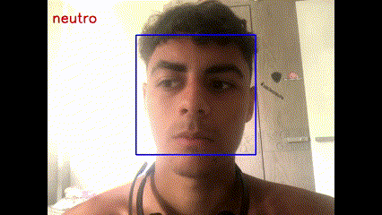

# Facial Expression Recognition using Deep Learning
This project implements a facial expression recognition system using deep learning techniques. It utilizes convolutional neural networks (CNNs) to classify facial expressions into seven categories: anger, disgust, fear, happiness, sadness, surprise, and neutral.

## Facial Detection Process
The facial detection process involves the following steps:

**Face Detection**: The OpenCV library is used to detect faces in real-time video frames. A Haar cascade classifier trained for face detection is employed for this purpose.

**Preprocessing**: Once a face is detected, it is extracted from the frame and preprocessed to ensure uniformity in size and orientation. The face region is resized to a standard size (e.g., 48x48 pixels) and converted to grayscale.

**Facial Expression Recognition**: The preprocessed face image is fed into a pre-trained deep learning model, which predicts the facial expression category. The model assigns one of the predefined emotion labels (anger, disgust, fear, happiness, sadness, surprise, or neutral) to the detected face.

**Display**: Finally, the original video frame is displayed with the detected face and the corresponding emotion label overlaid on it in real-time.

## Example:

ote: At present, the model can only detect one person at a time. I intend to improve this limitation as well as enhance the accuracy of the model in future iterations.

## Installed Libraries and Dataframes
The following libraries are required for running this project:

OpenCV
Keras
NumPy
The data used in this project is sourced from the FER2013 dataset, which is commonly used to train and test facial expression recognition models

